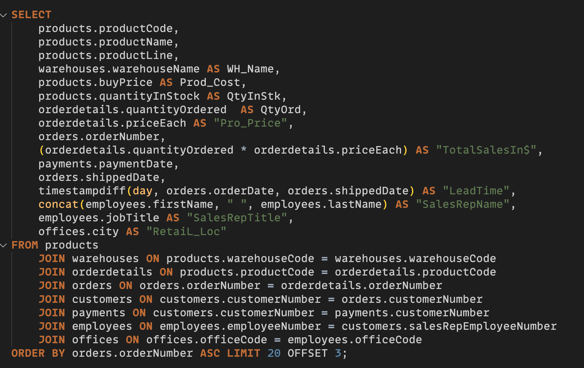

<h1 align="center"> ✨Inventory and Warehouse Optimization✨ </h1>


# *Project Description:*

This project focuses on data analysis within the retail sector, specifically for a global car dealership. The company sells a variety of cars from different manufacturers through its branches spread across several countries. The goal is to evaluate the company's existing operations and determine a strategy to close one of its warehouses, ensuring minimal impact on customer service.

The project consists of two main tasks:

1. Extracting meaningful insights from the data, and
2. Identifying the optimal warehouse for closure based on these insights.

We use MySQL Workbench and the command line to import the database, run SQL queries, and analyze data. The insights drawn from this analysis will guide the decision-making process, aiming to optimize inventory management and warehouse utilization. 

## 1.1. Dataset Import and Overview
- Begin by downloading the dump SQL file included in this repository. This file comprises the script needed to create and populate the database. Import the database into MySQL Workbench and ensure its successful import..

  

- Generate an entity-relationship diagram to comprehend the interrelationships among tables.


## 1.2.Data Exploration:
We initiate our analysis by examining raw data using simple SQL queries. By scrutinizing unique values in essential columns of the tables, we establish a foundational understanding of the dataset.
```sql
USE mintclassics;
SHOW TABLES;
```
Explore key tables to gain insight into the dataset's structure.


## 2. Extract Insight from the data
In this step, we examine the data and extract meaningful insights that will aid in making business decisions. Answering the following questions will provide us with valuable insight about the business operation, thereby helping to make informed decisions.

- **`Task 2.1:Extract key information across the tables and present it in a table.`**  This query result describes the ordered product descriptions, including productlines and warehouse locations, inventory and sales status, order details (number, details, price, etc.), customer and sales representative details..
   Here is the code snippet and the resutling table.

`Code snippet`


`Query output`


- **`Task 2.2: Check the total inventory across all warehouses.`** This query result shows the total number of items currently in stock. 
   Here is the code snippet and the resutling table.
  
`Code snippet`


`Query output`


The query results indicates that the Wareahouse Named South holds only small fraction of total inventory compared to other warehouses. 


- **`Task 2.3: Check which products have high iventory compared to order or salesamount.`** This query helps us identify the products that the company holds high inventory with little sales, causing the company storage cost and inventory holding costs. Identifying such products will enable the company to reduce its stock level and thereby optimize the inventory.
Here is the code snippet and the resulting table.
  
`Code snippet`


`Query output`


The query results indicate items with high inventory level with some 10 times the order amount. The company should reduce these inventories.

- **`Task 2.4: Check which products have low inventory compared to order or sales amount.`** This query helps us identify the products that the company holds low inventory with high sales, sometimes causing a shortage and out of stock affecting business operations.
Here is the code snippet and the resulting table.
  
`Code snippet`


`Query output`


- **`Task 2.5: Check which products have high inventory in a given warehouse.`** This query lists out the specific product inventory level at each warehouse. This enables the company to identify those products and reduce its inventory level at a particular warehouse, making it easier to decide which warehouse to close or downsize. Since we previously identified that the south warehouse is relatively inactive, if we identify products with high inventory in that warehouse and reduce its inventory level, it further reduces the overall inventory level at the store and makes the decision to close or further downsize much easier.
Here is the code snippet and the resulting table.
  
`Code snippet`


`Query output`


The query result identified products with high inventory levels. If the inventory level of those products is optimized, the decision to close down or downsize is much easier.

## 3. Business decision
Based on the meaningful insights extracted from the data, the following business decisions are suggested.
- For products with a shortage in inventory level, where the inventory level to order quantity ratio is less than one, the company needs to increase the inventory level of those products.
- Similarly, products with inventory surplus, where its inventory to order quantity ratio is greater than 2, need to be reduced to minimize inventory holding costs.
- The south warehouse has low inventory compared to other warehouses. If the identified products with high inventory levels are reduced, the south warehouse could be closed or significantly downsized.